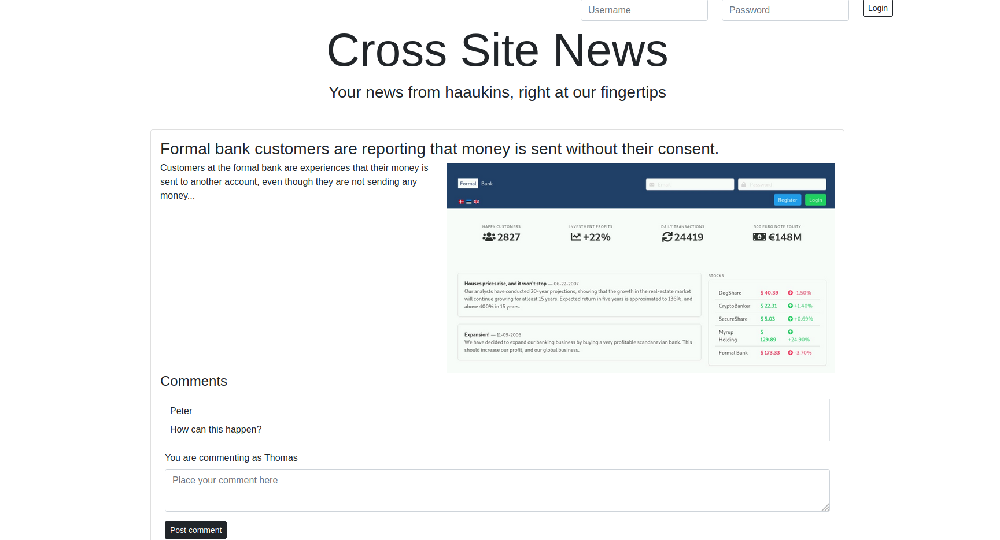
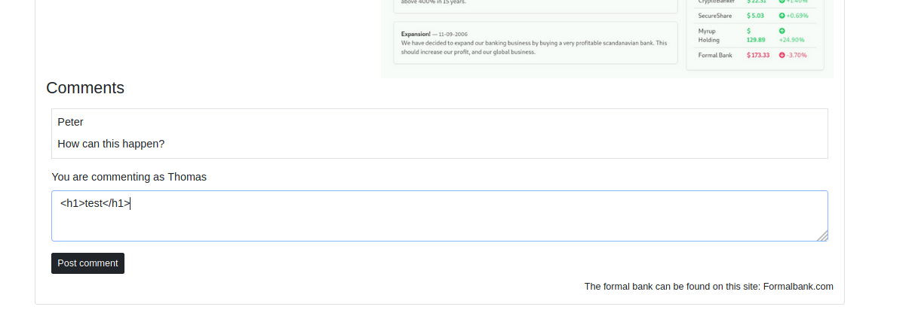
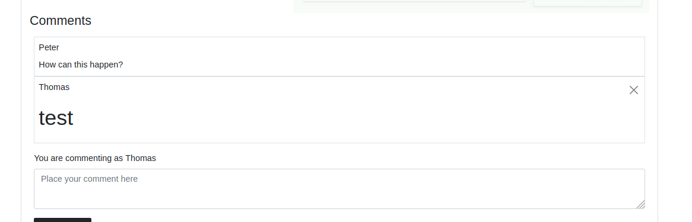
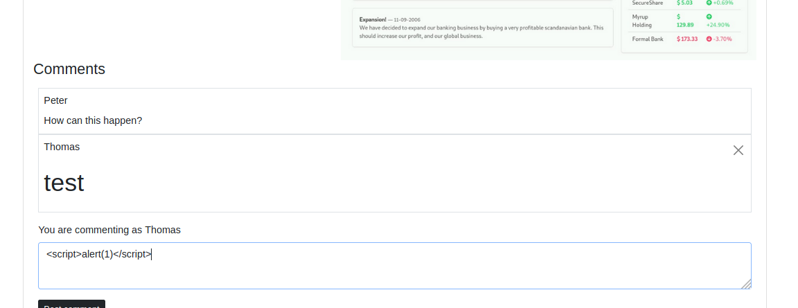
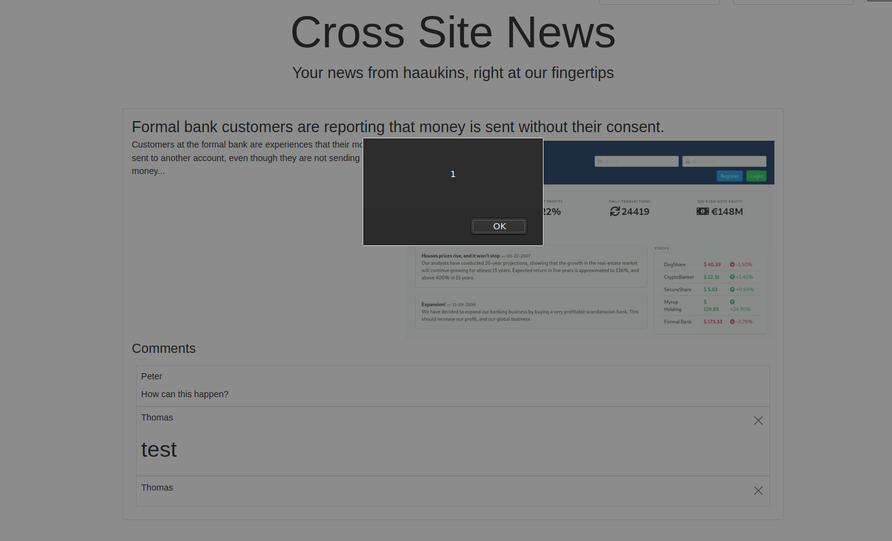
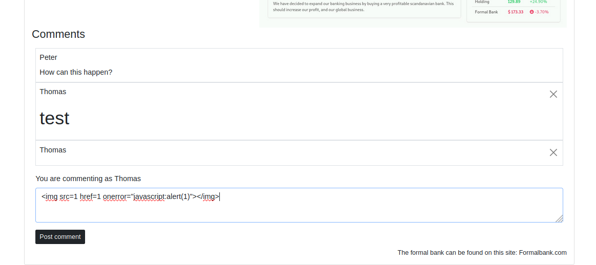
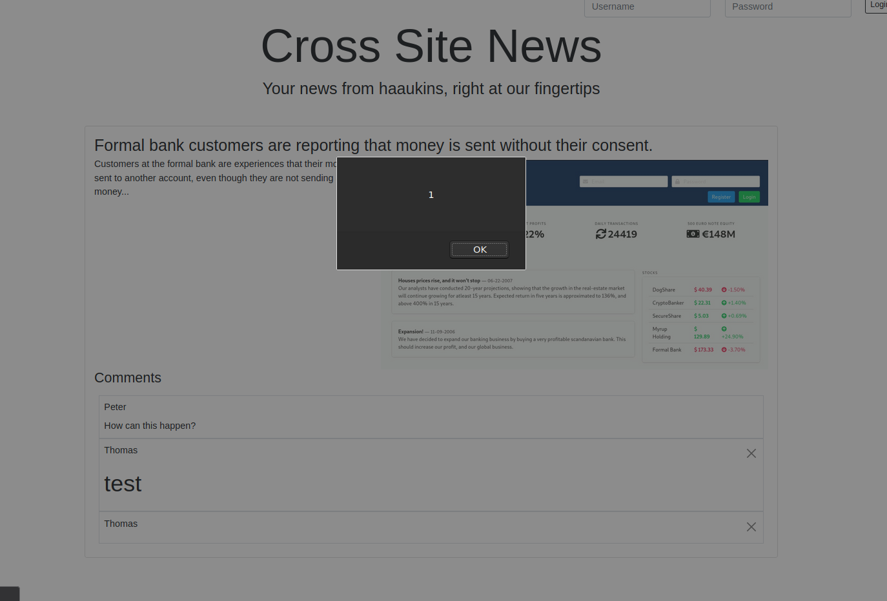
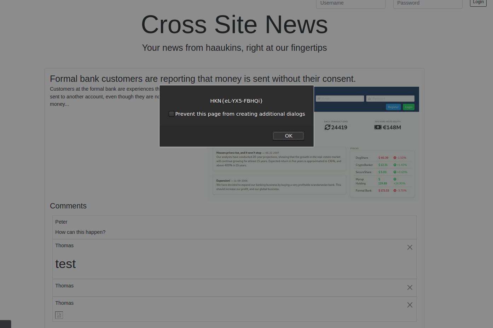

# CSN - Markdown

**Description:** CSN har fået ny side, men de har ikke fået helt styr på deres markdown og kan have problemer med XSS på siden. Kan du udnytte dette til din fordel på CSN.hkn?
**Points:** 10


We're presented with a website which looks like this:


As we know from the challenge description, we need to find out, if we can perform xss on the page.

The front page is full of input fields which could be vulnerable to xss.

Trying to input ```<h1>test</h1>``` to see if we can perform xss.




The HTML code were not filtered or encoded, we can use valid tags, which will be interpreted by the browser as HTML/JavaScript.

Trying now using a ```script``` tag instead.




The page successfully rendered the JS code, but no flag was given. I tried alerting ``document.cookie`` etc. but nothing worked.

I though the challenge maybe could be broken or i needed to reset the challenge - that was not the case.

I tried using a xss payload list ``https://github.com/payloadbox/xss-payload-list`` and just hammering the input forms with different payloads.

I came to the ``</img>`` payload - and after submitting that - it worked!




I didn't manage to solve the task during the competition, but afterwards it did.. :(