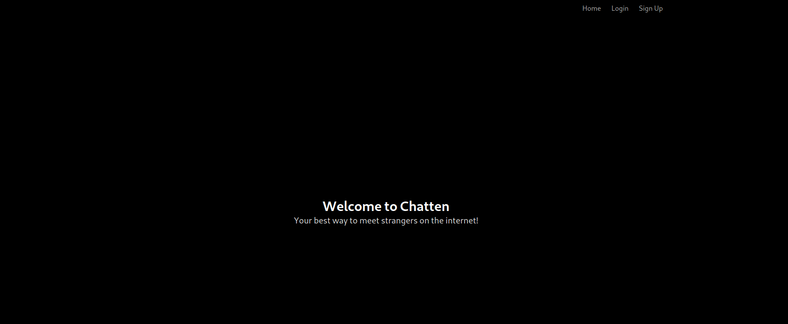
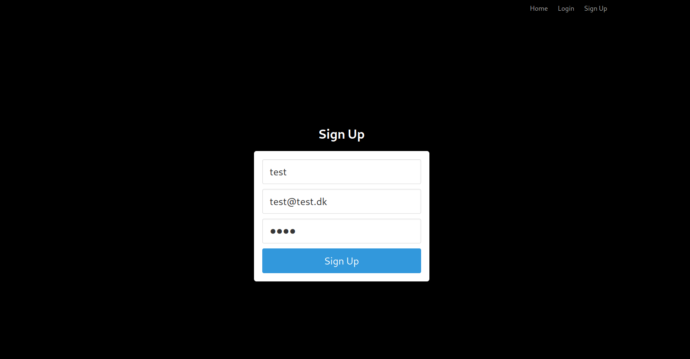
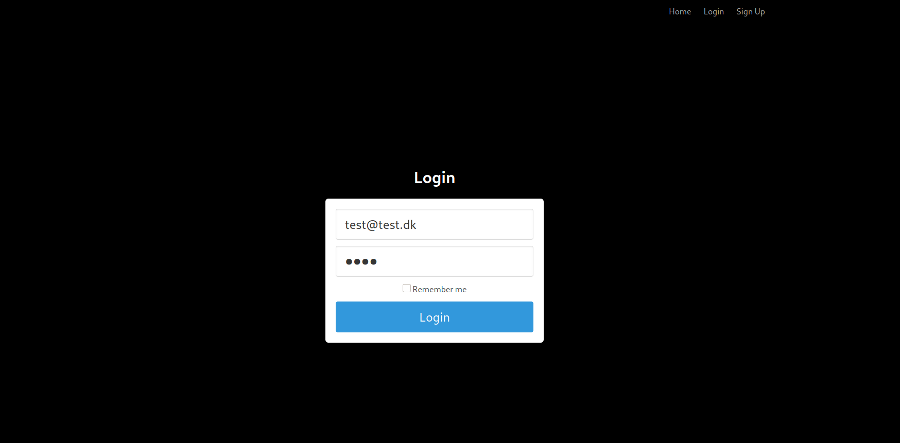
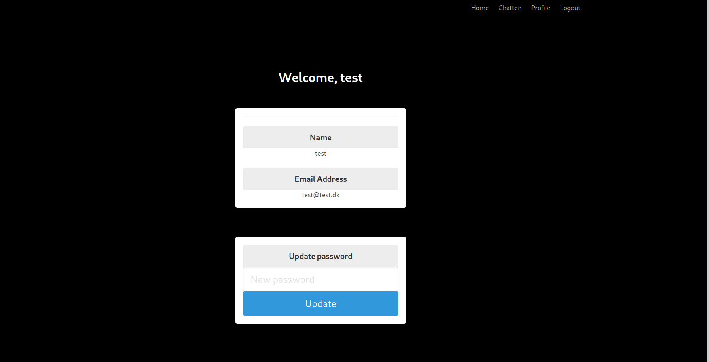
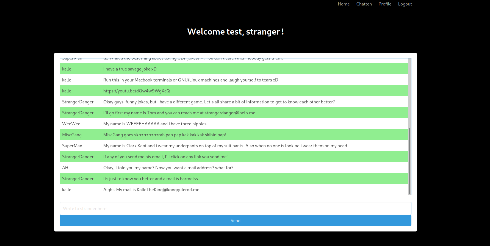
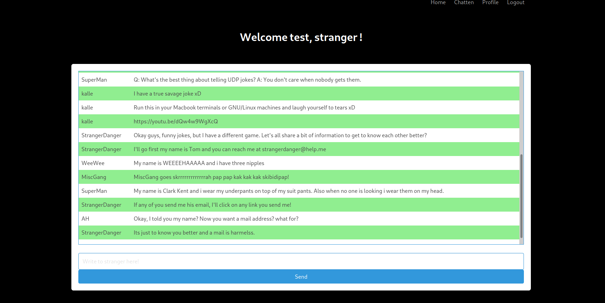
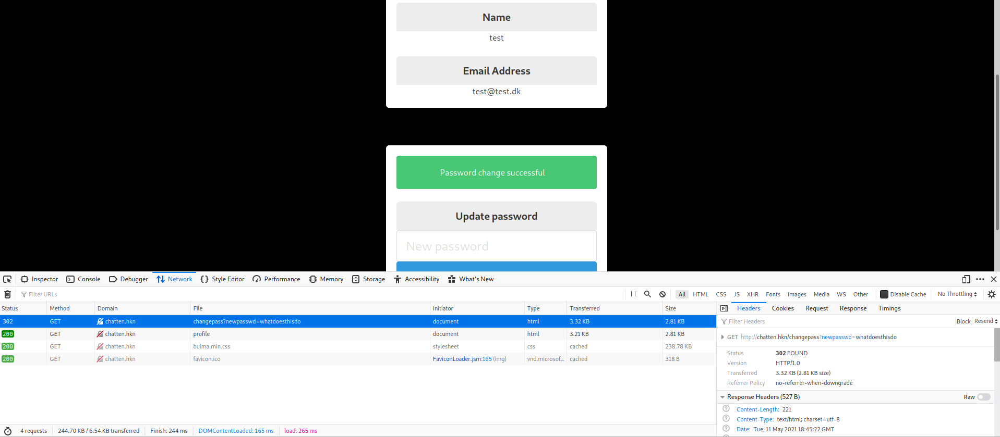
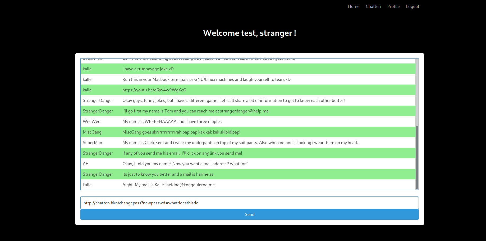
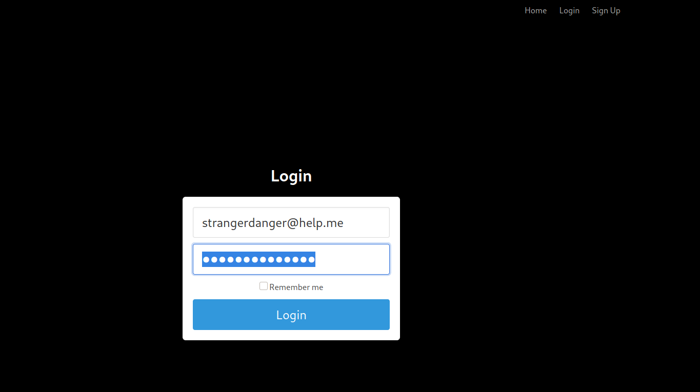
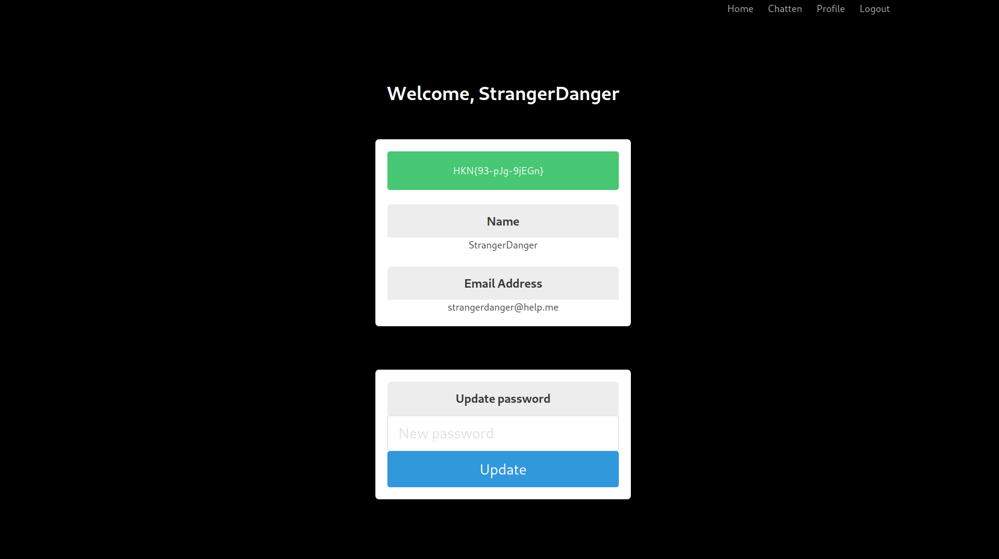

# Chatten

**Description:** Flaget er gemt et sted på chatten.hkn og muligvis på en bruger der er super glad for at trykke på en masse links. Log på fremmedes bruger for at finde flaget.
**Points:** 25

We're presented with a website which looks like this:

Before firing SQLmap at the login page or a gobuster/dirbuster scan, i wanted to see what the page actually contains. So i created an account and logged in. 

We're met with this page, when we're logged in. 

There is nothing interesting besides the update password form, if developed bad, could be exploited heavily.

I decided to explore the page.
There is only two other pages, the chatroom and the account page. 
The chat room looks like this:

I like to read all the messages, post etc. on the page when i'm solving a challenge, especially when there is only 2 pages available.

Reading the messages i read something very interesting from the user ``StrangerDanger``
He states, he'll click all the links you send him. He even provides you with is email address. Right away, I start thinking about whether I should maybe grab his cookie or some Cross Site Request Forgery of some kind.

There is not much else in the chat, so I choose to navigate around the page a bit.

I decided to look on the password reset form on the account page, since it was the only visible thing left.

I tried changing my password to ``whatdoesthisdo`` and look at the request in the network tab in the browser devtools. (Right click on the page - Press "Inspect"/"Inspect Element" - Press "Network" to open the network tab)

As you can see, the only thing needed for changing the password to ``whatdoesthisdo`` is going to the URL ``http://chatten.hkn/changepass?newpasswd=whatdoesthisdo``. This immediately teels me - this is a Cross Site Request Forgery challenge. 

I copied the request. Went back to the chat and posted the link into the chat. Since the user ``StrangeDanger`` clicks on every link in the chat, this will automatically change his password to ``whatdoesthisdo`` - assuming he´s logged in. 

I copied his mail, which he sent before in the chat, and logged out.
Logged in again with the mail: ``strangerdanger@help.me`` & Password ``whatdoesthisdo`` (Which was the password we choose to send as parameter in the chat.)

And there was the flag!

This challenge is similar to the FormalBank challenge on the haaukins platform.
