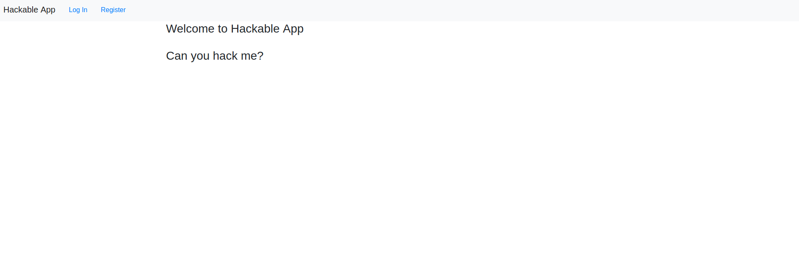
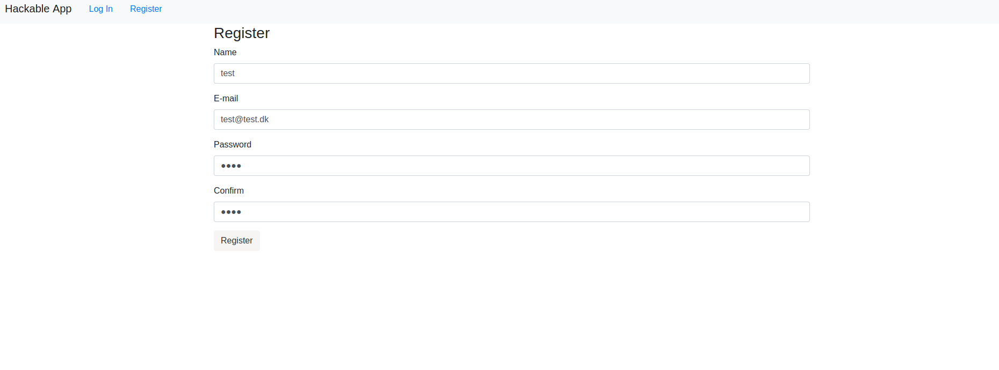
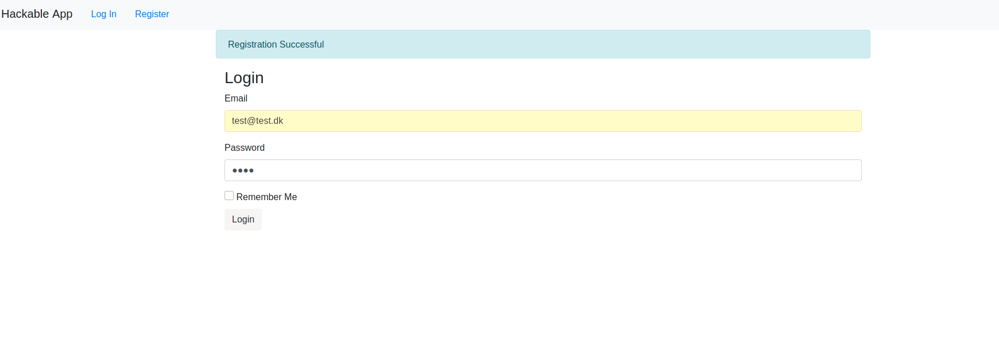
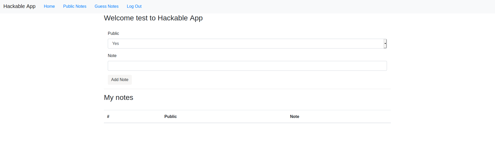
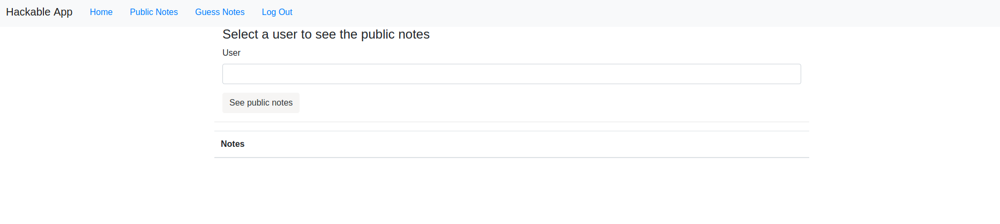
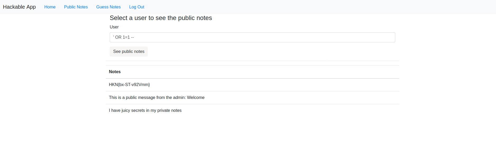

# Hackable

**Description:** Jeg er bange for at almindelige brugere kan få adgang til mine private noter, kan du hjælpe med at finde ud af om det kunne lade sig gøre uden at være logget ind som admin? Websitet hedder hackable.hkn

**Points:** 10

We're presented with a website which looks like this:

As we read in the challenge description, the challenge has something to do with some private notes which needs to be shown without being admin.

Before firing SQLmap at the login page, i wanted to see what the page actually contains. So i created an account and logged in. 

I started exploring the different pages on the website, and came across the "Public Notes" page. 

On the page -> if you guess the user name, then it will show you the notes of that specific user.
I started imagining how the query for the request could look like.

I thought of something like this.
``SELECT notes FROM user_notes WHERE user = '' ..``
 
I tried using a basic sql injection "payload" ``' OR 1 = 1 --``
So the query would look like:
``SELECT notes FROM user_notes WHERE user = ''' OR 1 = 1 -- .. ``

Which would result in showing all the users notes, because 1 is always 1.

Trying the "payload" on the page:

And boom! There is the flag.

The reason i chose to use ``'`` and not ``"`` and ``--`` instead of ``#`` was just pure guessing. I tried all the different options and the above one worked.
