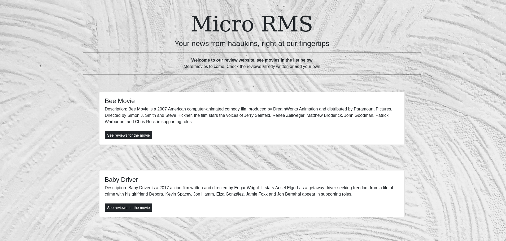
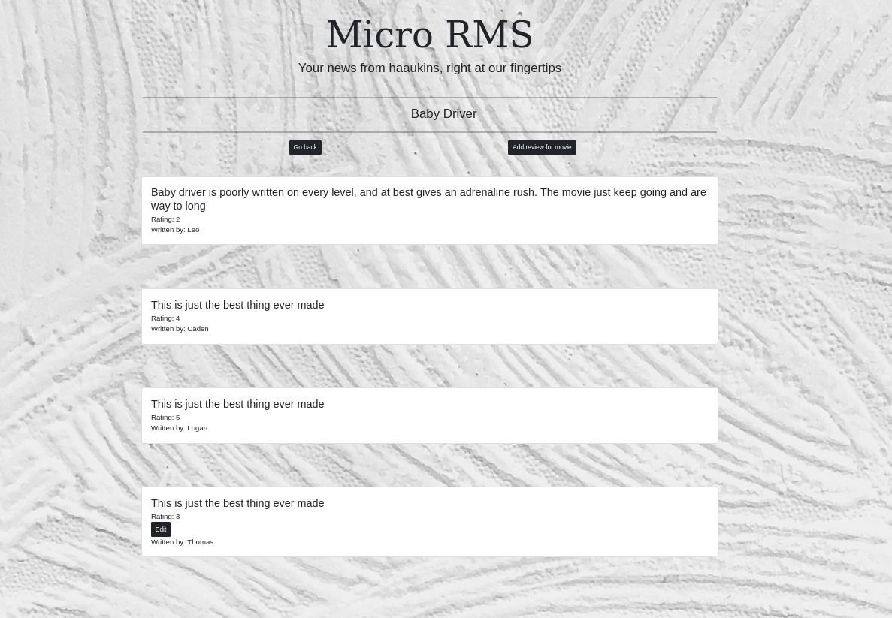
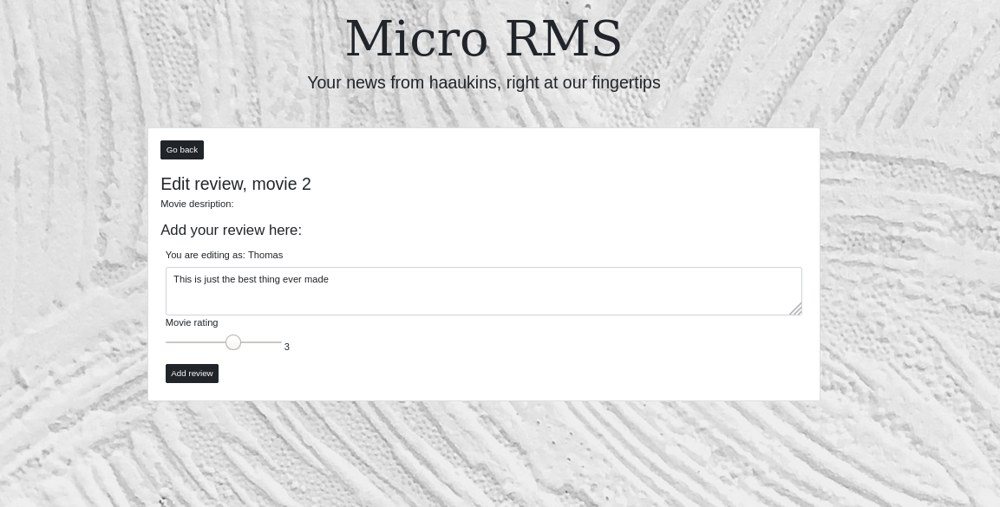
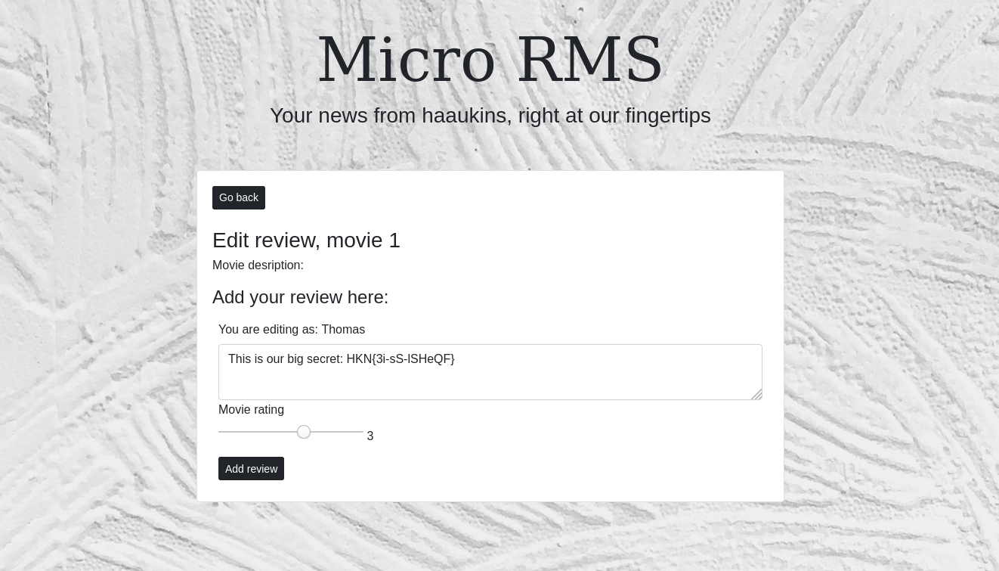

# Micro RMS - URL

**Description:** Man kan måske finde mere end hvad der knapper til ved at ændre URL gå til Micro-RMS.hkn og find ud af det.
**Points:** 10

We're presented with a website which looks like this:


As we know from the challenge description, we need to find out, if we can find some hidden information on the page by changing the URL.

On the frontpage there isn't really anything we can change the URL to. Therefore i decided to look on the other pages on the website. You could start a gobuster/dirbuster scan, but i want to do a it manually first.  

 I clicked on one of the movie reviews.




First i started to change the ``2`` in the url ```http://micro-rms.hkn/reviews/2``` to every number from ``0`` to like ``40-50``

But there wasn't anything.


There was a ``Edit`` button under the comments. Which redirects to the url ```http://micro-rms.hkn/editReview/2/11```. 




Again, i tried changing the ``11`` in the url ```http://micro-rms.hkn/editReview/2/11``` to every number from ``0`` to like ``40-50``

But after changing the ``11`` to a ``1`` (```http://micro-rms.hkn/editReview/2/1```) showed me the flag.




