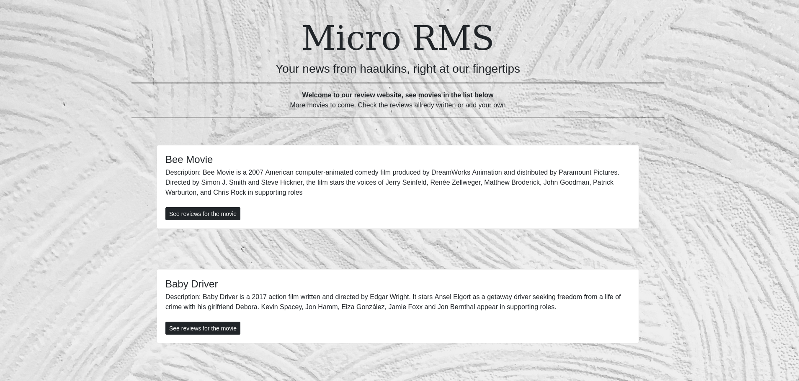
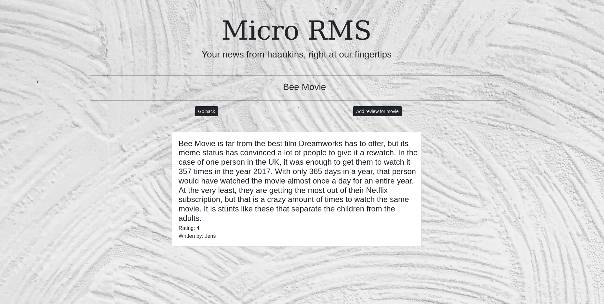
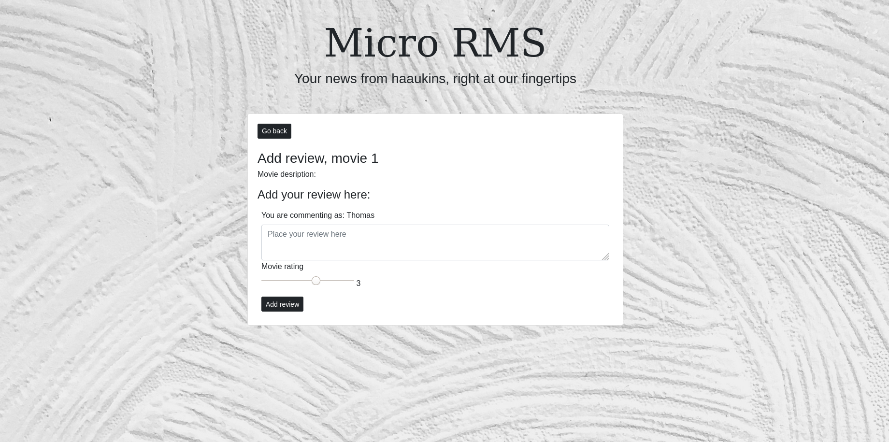
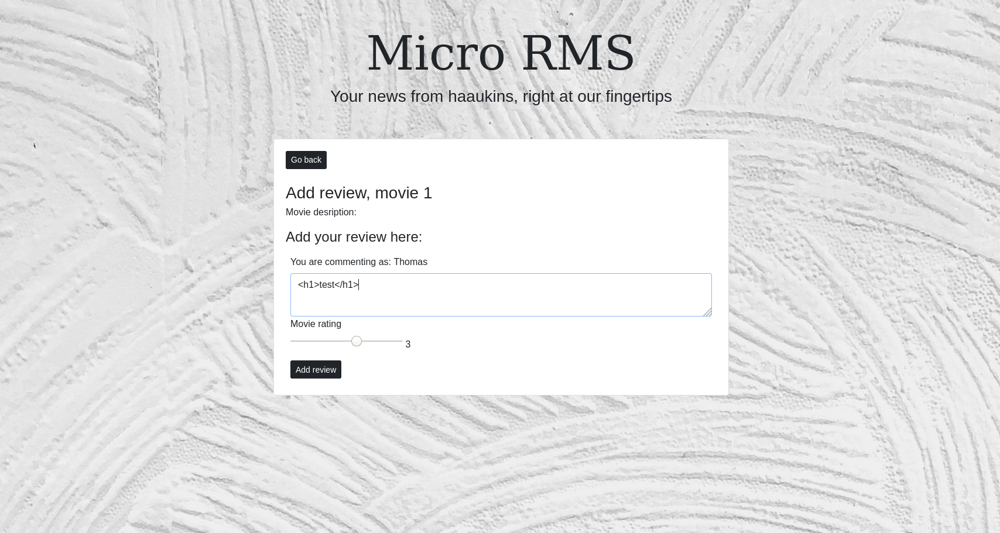
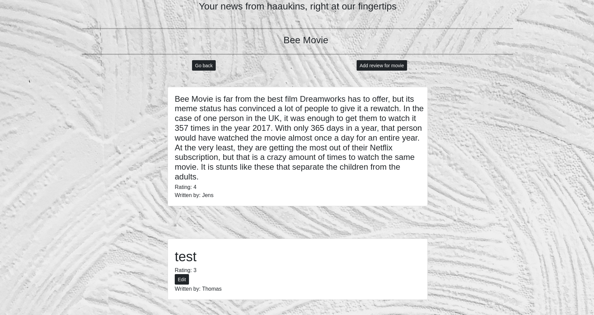
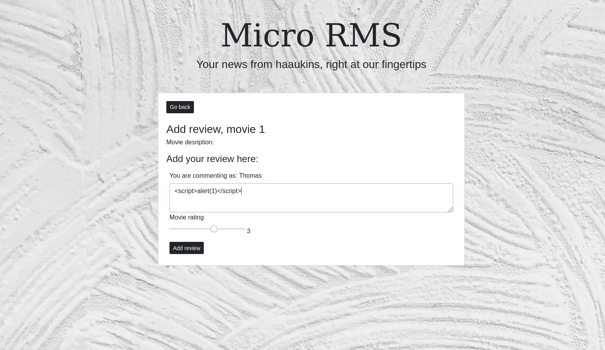
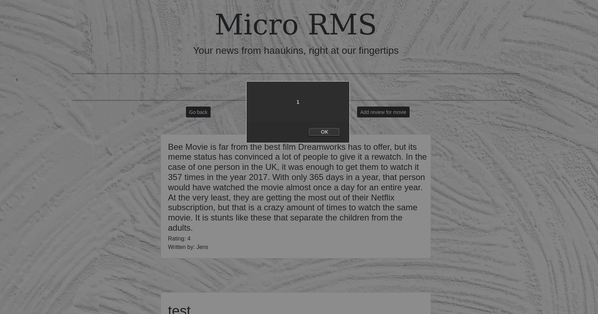
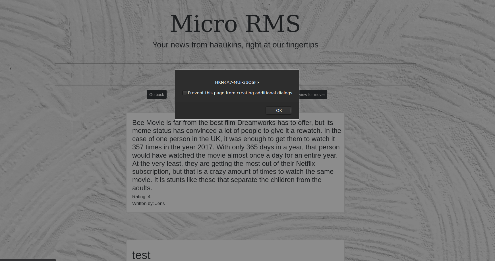

# Micro RMS - XSS

**Description:** Kan du bruge XSS her? prøv på Micro-RMS.hkn
**Points:** 10

We're presented with a website which looks like this:


As we know from the challenge description, we need to find out, if we can perform xss on the page.

On the frontpage there isn't really anything we can perfrom xss on. Therefore i decided to look on the other pages on the website. 

Clicking on the "See reviews for the movie" leads us to ```http://micro-rms.hkn/reviews/1``` which looks like this.



There isn't anything here either, so i decided to move on to the "Add review for movie" button ```http://micro-rms.hkn/addReview/1```which looks like this.



There is a input form on this page, which could lead to xss.
Trying to input ```<h1>test</h1>``` to see if we can perform xss.






The HTML code were not filtered or encoded, we can use valid tags, which will be interpreted by the browser as HTML/JavaScript.

Trying now using a ```script``` tag instead.





It worked! Clicking on OK and then we'll get the flag.



There is the flag!